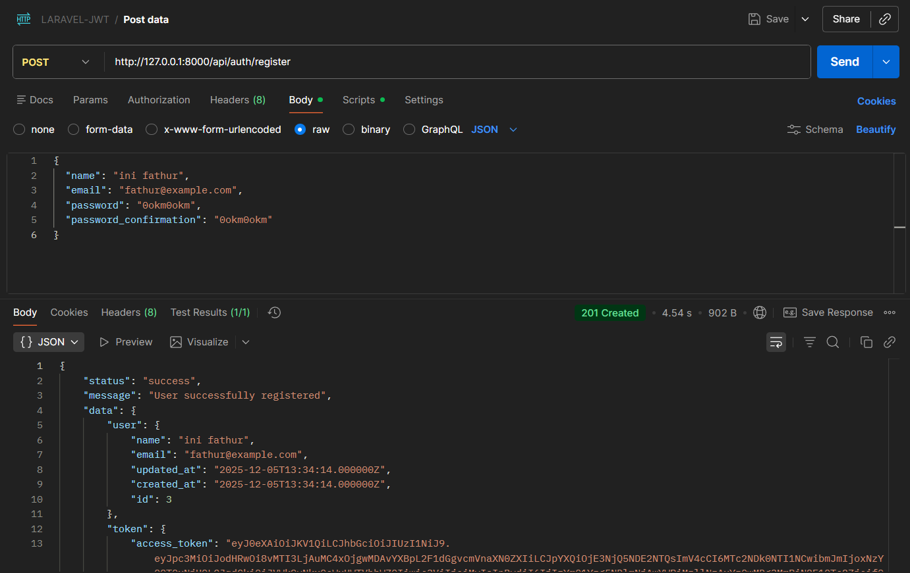
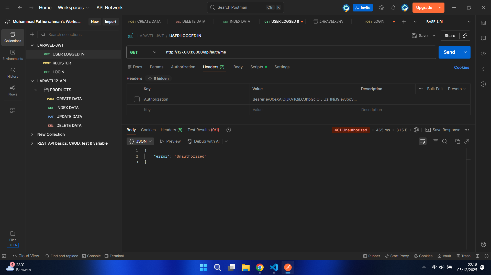
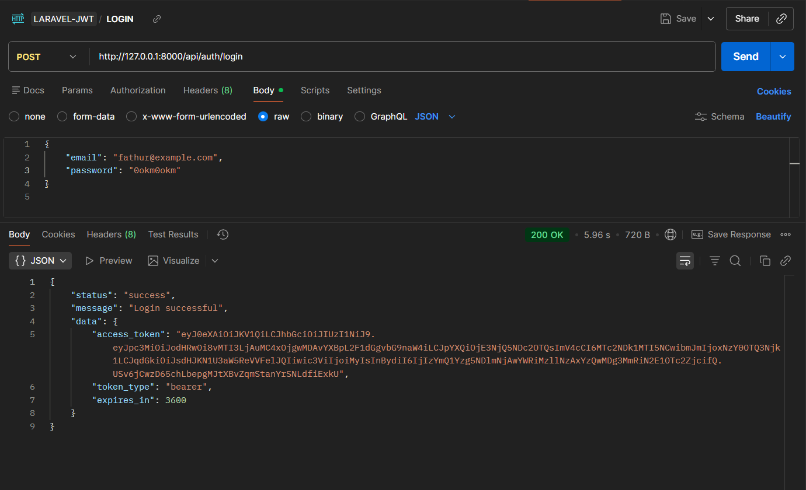
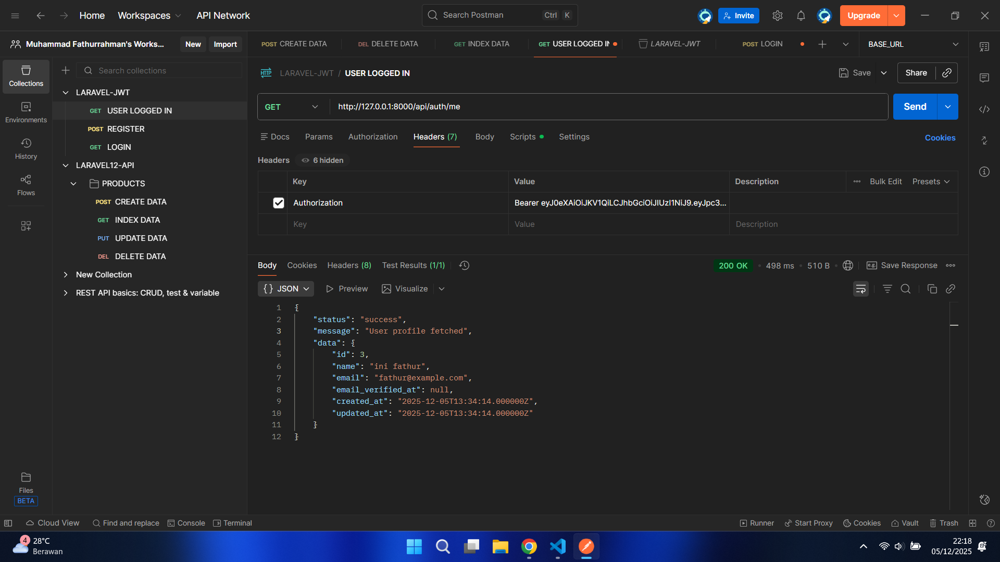
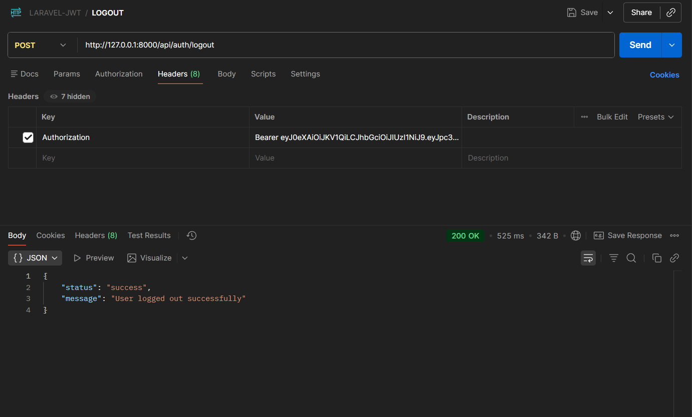

# Laporan Modul 10: Authentication JWT

**Mata Kuliah:** Workshop Web Lanjut  
**Nama:** Muhammad Fathurrahman  
**NIM:** 2024573010004
**Kelas:** TI-2C

---

## Abstrak

Laporan ini membahas penerapan autentikasi menggunakan JWT (JSON Web Token) pada aplikasi Laravel untuk mengamankan akses API. JWT digunakan sebagai mekanisme otentikasi yang memungkinkan server memverifikasi identitas user berdasarkan token tanpa perlu menyimpan sesi. Pembahasan meliputi instalasi library JWT, konfigurasi guard, pembuatan middleware untuk validasi token, serta implementasi fitur register, login, logout, refresh token, dan melihat profil user. Selain itu, laporan juga memperlihatkan pengujian endpoint menggunakan Postman untuk memastikan token bekerja dengan benar.

---

## 1. Dasar Teori

### Apa Itu JWT?
JWT adalah sebuah standar terbuka yang mendefinisikan cara aman untuk mentransmisikan informasi antara dua pihak sebagai sebuah JSON Object. Token ini berbentuk string panjang yang terdiri dari tiga bagian utama, dipisahkan dengan tanda titik (.):

- Header – berisi informasi algoritma enkripsi dan tipe token.

- Payload – berisi data atau klaim (misalnya: user_id, role, atau informasi lain).
- Signature – hasil enkripsi dari header + payload dengan secret key tertentu, digunakan untuk memastikan token tidak bisa diubah sembarangan.

Contoh token JWT sederhana kira-kira akan terlihat seperti ini:

```bash
eyJhbGciOiJIUzI1NiIsInR5cCI6IkpXVCJ9.
eyJ1c2VyX2lkIjoxLCJyb2xlIjoiYWRtaW4ifQ.
TJVA95OrM7E2cBab30RMHrHDcEfxjoYZgeFONFh7HgQ
```

---

## 2. Langkah-Langkah Praktikum

Tuliskan langkah-langkah yang sudah dilakukan, sertakan potongan kode dan screenshot hasil.

### 2.1 Praktikum 1 – Autentikasi JWT

-   Pada Proyek Laravel sebelumnya `laravel-api`, install    package populer `tymon/jwt-auth` dengan menjalankan perintah berikut"
    ```bash
    composer require tymon/jwt-auth
    ```
-   #### Publish Config
    Setelah package berhasil di-install, kita perlu mem-publish file konfigurasi agar bisa disesuaikan dengan kebutuhan project.

    Jalankan perintah:
    ```bash
    php artisan vendor:publish --provider="Tymon\JWTAuth\Providers\LaravelServiceProvider"
    ```
    
-   #### Generate Secret Key
    Buat secret key dengan perintah:
    ```
    php artisan jwt:secret
    ```
    
-  #### Konfigurasi Guard
    Silakan buka file config/auth.php, lalu ubah bagian guards menjadi seperti berikut:
    ```bash
    'guards' => [
    'api' => [
        'driver' => 'jwt',
        'provider' => 'users',
        ],
    ],
    ```
-   #### Modifikasi User Model
    Silakan buka file `app/Models/User.php`, lalu tambahkan kode berikut:
    ```bash
    use Tymon\JWTAuth\Contracts\JWTSubject;

    class User extends Authenticatable implements JWTSubject
    {
        /**
        * Ambil identifier unik user yang akan disimpan di dalam JWT.
        */
        public function getJWTIdentifier()
        {
            return $this->getKey(); // biasanya ID user
        }

        /**
        * Tambahkan klaim (claims) tambahan jika diperlukan.
        */
        public function getJWTCustomClaims()
        {
            return [];
        }
    }

    ```
    
-   #### Membuat Middleware Baru
    
    Untuk membuat middleware khusus JWT, silakan jalankan perintah artisan berikut:
    ```bash
    php artisan make:middleware JwtMiddleware
    ```

-   #### Mengisi Logika Middleware
    Setelah file dibuat, buka `JwtMiddleware.php` dan isi dengan logika untuk memvalidasi token JWT. Ubah menjadi seperti berikut ini:
    ```bash
    <?php

    namespace App\Http\Middleware;

    use Closure;
    use Tymon\JWTAuth\Facades\JWTAuth;
    use Exception;
    use Illuminate\Http\Request;

    class JwtMiddleware
    {
        public function handle(Request $request, Closure $next)
        {
            try {
                JWTAuth::parseToken()->authenticate();
            } catch (Exception $e) {
                return response()->json(['error' => 'Unauthorized'], 401);
            }

            return $next($request);
        }
    }
    ```
    
-   #### Pendaftaran Middleware di Laravel 11/12
    Silakan buka `bootstrap/app.php` dan ubah menjadi seperti berikut ini:
    ```bash
    <?php

    use Illuminate\Foundation\Application;
    use Illuminate\Foundation\Configuration\Exceptions;
    use Illuminate\Foundation\Configuration\Middleware;
    use App\Http\Middleware\JwtMiddleware;

    return Application::configure(basePath: dirname(__DIR__))
        ->withRouting(
            web: __DIR__ . '/../routes/web.php',
            api: __DIR__ . '/../routes/api.php',
            commands: __DIR__ . '/../routes/console.php',
            health: '/up',
        )
        ->withMiddleware(function (Middleware $middleware) {
            // Middleware untuk API
            $middleware->api(prepend: [
                \Laravel\Sanctum\Http\Middleware\EnsureFrontendRequestsAreStateful::class,
            ]);

            // Alias middleware custom
            $middleware->alias([
                'verified' => \App\Http\Middleware\EnsureEmailIsVerified::class,
                'jwt' => JwtMiddleware::class,
            ]);
        })
        ->withExceptions(function (Exceptions $exceptions) {
            //
        })->create();

    ```
    

-   #### Membuat Controller
    Silakan jalankan perintah berikut ini:
    ```bash
    php artisan make:controller API\AuthController
    ```
    Buka file nya lalu masukkan kode ini:
    ```bash
    <?php

    namespace App\Http\Controllers\API;

    use App\Http\Controllers\Controller;
    use Illuminate\Http\Request;
    use App\Models\User;
    use Illuminate\Support\Facades\Hash;
    use Illuminate\Support\Facades\Validator;
    use Tymon\JWTAuth\Facades\JWTAuth;
    use Tymon\JWTAuth\Exceptions\JWTException;

    class AuthController extends Controller
    {
        /**
        * Register user baru
        */
        public function register(Request $request)
        {
            $validator = Validator::make($request->all(), [
                'name'     => 'required|string|max:255',
                'email'    => 'required|email|unique:users',
                'password' => 'required|string|min:6|confirmed',
            ]);

            if ($validator->fails()) {
                return response()->json([
                    'status'  => 'error',
                    'message' => 'Validation failed',
                    'errors'  => $validator->errors()
                ], 422);
            }

            $user = User::create([
                'name'     => $request->name,
                'email'    => $request->email,
                'password' => Hash::make($request->password),
            ]);

            $token = JWTAuth::fromUser($user);

            return response()->json([
                'status'  => 'success',
                'message' => 'User successfully registered',
                'data'    => [
                    'user'  => $user,
                    'token' => $this->respondWithToken($token),
                ]
            ], 201);
        }

        /**
        * Login user
        */
        public function login(Request $request)
        {
            $credentials = $request->only('email', 'password');

            try {
                if (!$token = JWTAuth::attempt($credentials)) {
                    return response()->json([
                        'status'  => 'error',
                        'message' => 'Invalid credentials'
                    ], 401);
                }
            } catch (JWTException $e) {
                return response()->json([
                    'status'  => 'error',
                    'message' => 'Could not create token',
                    'error'   => $e->getMessage()
                ], 500);
            }

            return response()->json([
                'status'  => 'success',
                'message' => 'Login successful',
                'data'    => $this->respondWithToken($token),
            ]);
        }

        /**
        * Logout user (invalidate token)
        */
        public function logout()
        {
            try {
                JWTAuth::invalidate(JWTAuth::getToken());

                return response()->json([
                    'status'  => 'success',
                    'message' => 'User logged out successfully'
                ]);
            } catch (JWTException $e) {
                return response()->json([
                    'status'  => 'error',
                    'message' => 'Failed to logout, token invalid',
                    'error'   => $e->getMessage()
                ], 500);
            }
        }

        /**
        * Refresh token
        */
        public function refresh()
        {
            try {
                $newToken = JWTAuth::refresh(JWTAuth::getToken());

                return response()->json([
                    'status'  => 'success',
                    'message' => 'Token refreshed',
                    'data'    => $this->respondWithToken($newToken),
                ]);
            } catch (JWTException $e) {
                return response()->json([
                    'status'  => 'error',
                    'message' => 'Failed to refresh token',
                    'error'   => $e->getMessage()
                ], 401);
            }
        }

        /**
        * Get user profile
        */
        public function me()
        {
            try {
                $user = JWTAuth::parseToken()->authenticate();

                return response()->json([
                    'status'  => 'success',
                    'message' => 'User profile fetched',
                    'data'    => $user
                ]);
            } catch (JWTException $e) {
                return response()->json([
                    'status'  => 'error',
                    'message' => 'Token is invalid or expired',
                    'error'   => $e->getMessage()
                ], 401);
            }
        }

        /**
        * Helper: format token response
        */
        protected function respondWithToken($token)
        {
            return [
                'access_token' => $token,
                'token_type'   => 'bearer',
                'expires_in'   => JWTAuth::factory()->getTTL() * 60, // dalam detik
            ];
        }
    }
    ```

-   #### Konfigurasi Rute
    Silakan buka file api.php di folder routes dan ubah menjadi seperti ini:
    ```bash
    <?php

    use Illuminate\Support\Facades\Route;
    use App\Http\Controllers\Api\AuthController;
    use App\Http\Controllers\Api\ProductController;

    Route::prefix('auth')->name('auth.')->group(function () {
        Route::post('register', [AuthController::class, 'register'])->name('register');
        Route::post('login', [AuthController::class, 'login'])->name('login');

        Route::middleware('jwt')->group(function () {
            Route::post('logout', [AuthController::class, 'logout'])->name('logout');
            Route::get('me', [AuthController::class, 'me'])->name('me');
            Route::post('refresh', [AuthController::class, 'refresh'])->name('refresh');
        });
    });

    Route::middleware('jwt')->group(function () {
        Route::apiResource('products', ProductController::class);
    });
    ```

-   #### Response Register Sukses
    
-   #### Response Register Error
    
-   #### Response Login
    
-   #### Get Profile
    Setelah kita berhasil mendapatkan token dari proses login, sekarang kita akan menggunakannya untuk menguji endpoint profile user. Pada bagian Headers tambahkan Key `Authorization` dan isi value nya dengan:
    ```
    Bearer <token_yang_didapat_dari_login>
    ```
    Kalau langkahnya benar, maka API akan merespons seperti pada gambar dibawah ini:
    
-   #### Logout
    Kita akan menguji proses logout. Tujuannya adalah untuk mengakhiri sesi dan membuat token yang digunakan sebelumnya tidak bisa dipakai lagi. Sesuaikan endpoint nya seperti berikut dan Headers nya diisi sesuai token yang didapat dari login tadi. Jika benar maka akan tampak seperti berikut
    


---

## 3. Kesimpulan

Dari praktikum ini dapat disimpulkan bahwa JWT merupakan metode autentikasi yang sangat efektif untuk aplikasi berbasis API karena bersifat stateless, ringan, dan mudah digunakan pada berbagai platform. Dengan menggunakan JWT, proses login menghasilkan token yang dapat digunakan untuk mengakses endpoint yang dilindungi tanpa perlu menyimpan data sesi di server. Implementasinya di Laravel meliputi konfigurasi package tymon/jwt-auth, pengaturan guard, middleware untuk validasi token, serta pembuatan endpoint autentikasi. Pengujian melalui Postman membuktikan bahwa setiap endpoint berjalan dengan baik, mulai dari register, login, hingga proteksi akses menggunakan token. Secara keseluruhan, JWT memberikan solusi autentikasi yang aman dan fleksibel untuk pengembangan aplikasi modern.

---

## 4. Referensi

Cantumkan sumber yang Anda baca (buku, artikel, dokumentasi) — minimal 2 sumber. Gunakan format sederhana (judul — URL).

Tutorial Laravel 12 RESTful API — https://lagikoding.com/episode/tutorial-laravel-12-restful-api-1-install-laravel-12
Tutorial Laravel Rest API Untuk Pemula — https://www.rumahweb.com/journal/tutorial-laravel-rest-api/

---
