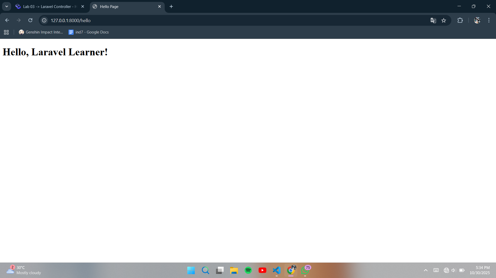
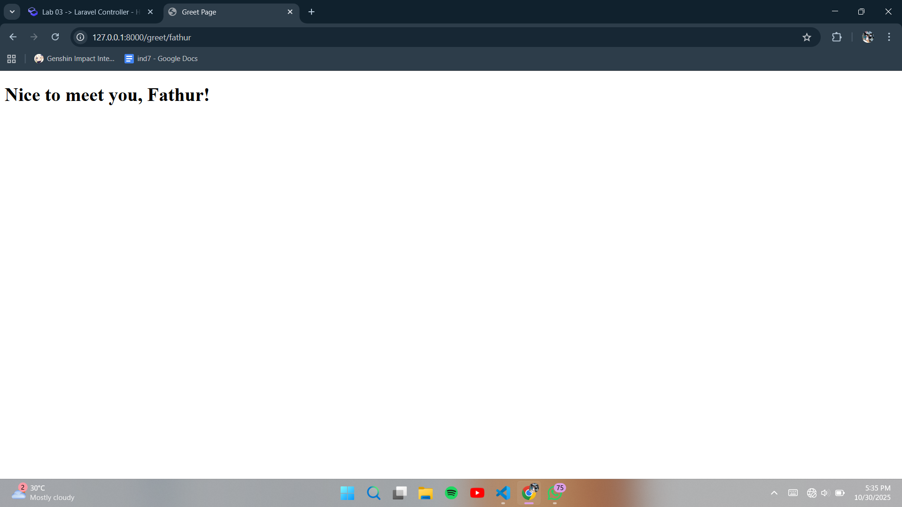
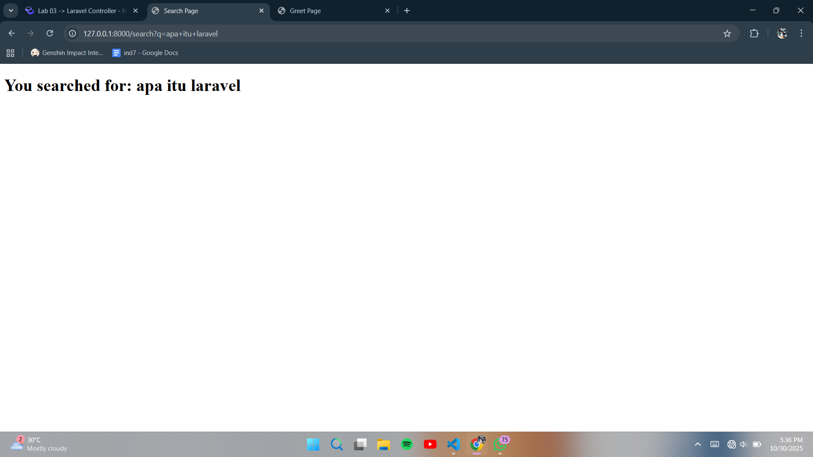
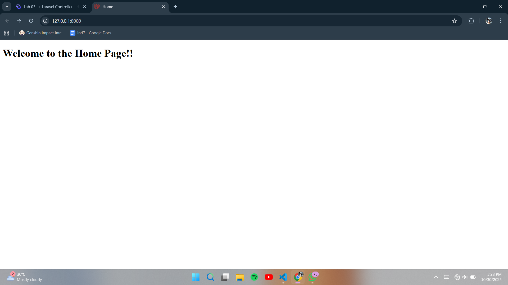
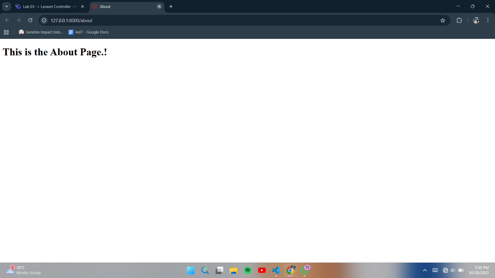
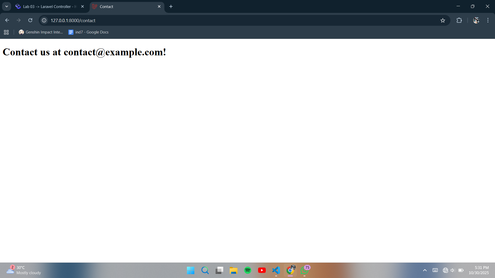
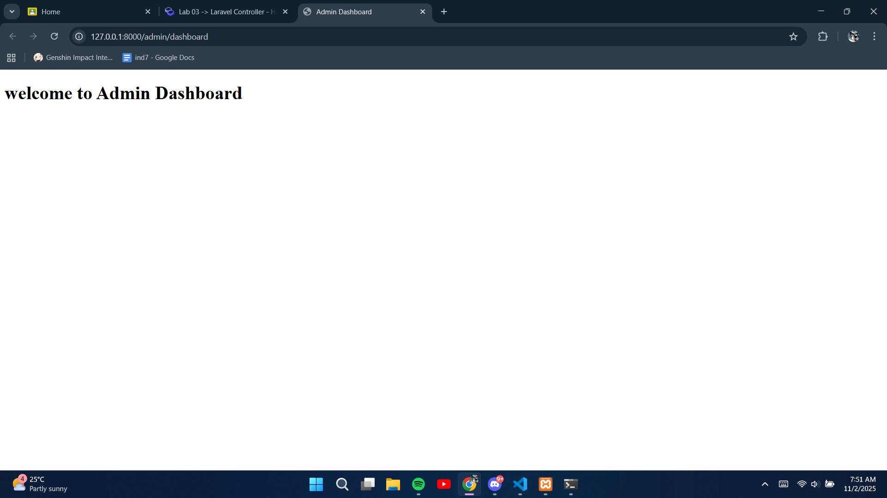
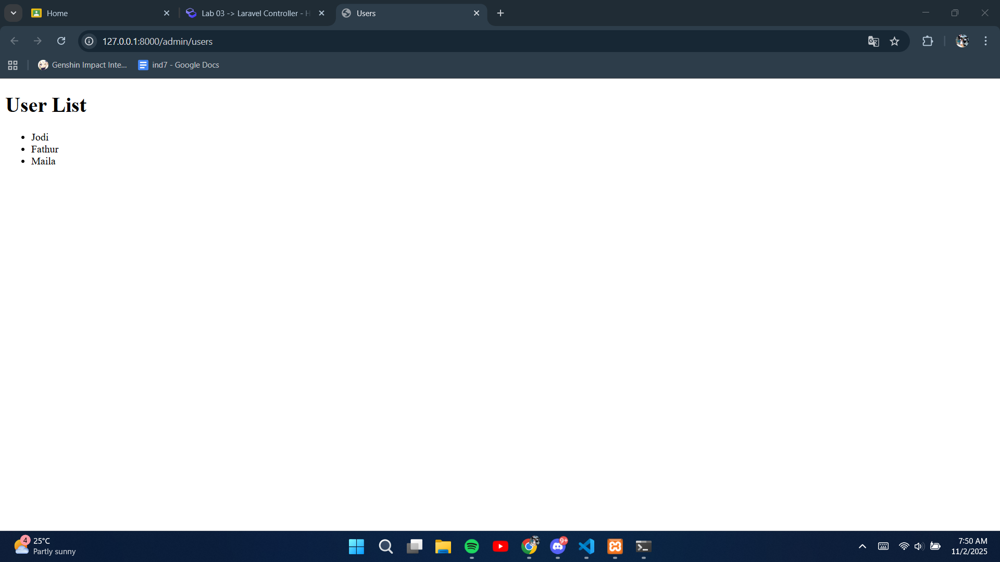
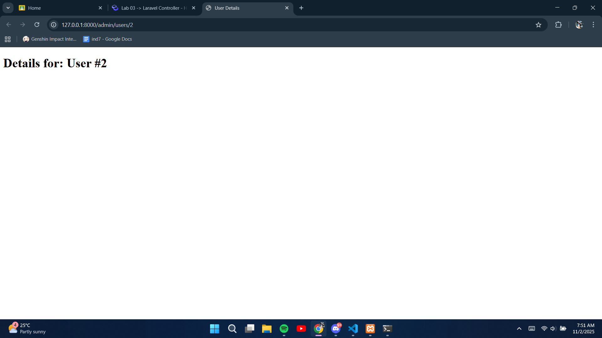

# Laporan Modul 3: Laravel Controller
**Mata Kuliah:** Workshop Web Lanjut   
**Nama:** Muhammad Fathurrahman  
**NIM:** 2024573010004
**Kelas:** TI-2C

---

## Abstrak 
Laporan ini membahas tentang Controller pada Laravel, pada laporan ini memperkenalkan berbagai jenis controller, cara membuatnya, dan praktik terbaik untuk mengorganisir logika controller.

---

## 1. Dasar Teori
- **Apa itu Controller**
Controller pada Laravel berfungsi sebagai penghubung antara model dan view dalam arsitektur MVC (Model-View-Controller), yang bertugas untuk mengatur alur logika aplikasi. Pada praktikum ini, pembuatan controller dilakukan dengan menggunakan perintah artisan seperti php artisan make:controllear, yang menghasilkan file controller di dalam direktori app/Http/Controllers. Controller digunakan untuk menangani permintaan dari user, memproses data melalui model, dan mengirimkan hasilnya ke view. Melalui metode-metode di dalam controller, proses pengelolaan data seperti menampilkan, menambah, mengubah, dan menghapus dapat diatur dengan lebih rapi dan terstruktur. Dengan adanya controller, kode menjadi lebih terorganisir, mudah dikelola, serta mendukung prinsip pemisahan tanggung jawab dalam pengembangan aplikasi Laravel.

---

## 2. Langkah-Langkah Praktikum
Tuliskan langkah-langkah yang sudah dilakukan, sertakan potongan kode dan screenshot hasil.

2.1 Praktikum 1 – Menangani Request dan Response View

- Buat projek laravel baru bernama `lab-view`
- Buat controller bernama DemoController
- Tambahkan route pada `routes/web.php`.
- Buat view baru sebagai berikut:
  - hello.blade.php.
  - greet.blade.php
  - search.blade.php
- Jalankan aplikasi dan tunjukkan hasil di browser.

Screenshot Hasil:
Meneruskan data ke view

Dengan parameter:

Query string:

2.2 Praktikum 2 – Menggunakan Group Route

- Buat proyek laravel baru bernama `lab-group`
- Buat controller bernama PageController
- Definisikan route nya
- Buat view baru sebagai berikut dalam folder `pages/`:
  - home.blade.php.
  - about.blade.php
  - contact.blade.php
- Jalankan aplikasi dan coba di browser
  - http://127.0.0.1:8000/ → Home
  - http://127.0.0.1:8000/about → About
  - http://127.0.0.1:8000/contact → Contact

Screenshot Hasil:
Home:

About:

Contact:

2.3 Praktikum 3 - Pengelompokan Prefix dengan Namespace Rute

 Buat proyek laravel baru bernama `lab-prefix`
- Buat controller dalam `admin/` bernama DashboardController dan UserController
- Definisikan route nya dengan prefix dan namespace
- Buat view baru dalam `resources/views/admin/` sebagai berikut:
  - dashboard.blade.php.
  - users/index.blade.php
- Jalankan aplikasi dan coba di browser
  - http://127.0.0.1:8000/dashboard
  - http://127.0.0.1:8000/users
  - http://127.0.0.1:8000/users2

Screenshot Hasil:
/admin/dashboard

/admin/users

/admin/users2

---

## 3. Hasil dan Pembahasan
Jelaskan apa hasil dari praktikum yang dilakukan.
- Apakah semua controller dan route berjalan sesuai fungsi masing-masing?
Ya, seluruh controller yang dibuat seperti DemoController, PageController, dan DashboardController berjalan sesuai fungsinya. Setiap route yang didefinisikan dapat diakses melalui browser dan menampilkan view yang sesuai tanpa error.
- Apa keuntungan menggunakan Group Route dan Prefix dalam Laravel?
Penggunaan group route dan prefix membantu mengelompokkan rute dengan lebih rapi. Misalnya, semua route yang berada di bawah `/admin` bisa dikelompokkan ke dalam satu prefix admin.
- Apa peran Namespace dalam struktur controller Laravel?
Namespace digunakan untuk mengorganisir controller dalam folder tertentu seperti `Admin\DashboardController`. Dengan namespace, Laravel tahu letak file controller yang dipanggil.

---

## 4. Kesimpulan
Dari hasil praktikum ini dapat disimpulkan bahwa Controller memiliki peran penting dalam arsitektur MVC Laravel karena bertanggung jawab mengatur logika aplikasi antara Route, Model, dan View. Dengan memahami cara kerja controller, route grouping, prefix, dan namespace, pengembang dapat membuat aplikasi web yang lebih terorganisir dan mudah dikelola.

---

## 5. Referensi
Cantumkan sumber yang Anda baca (buku, artikel, dokumentasi) — minimal 2 sumber. Gunakan format sederhana (judul — URL).

Modul 3 Laravel Controller - https://hackmd.io/@mohdrzu/H1sB73dnxg
Codepolitan: “Belajar Routing Laravel” – https://www.codepolitan.com/blog/belajar-routing-laravel/
BuildWithAngga – https://buildwithangga.com/tips/belajar-validasi-laravel-dan-50-contoh-validasi-pada-projek-nyata
Rumahweb Journal: “Blade Template Engine” – https://www.rumahweb.com/journal/belajar-laravel-bagian-4/

---
