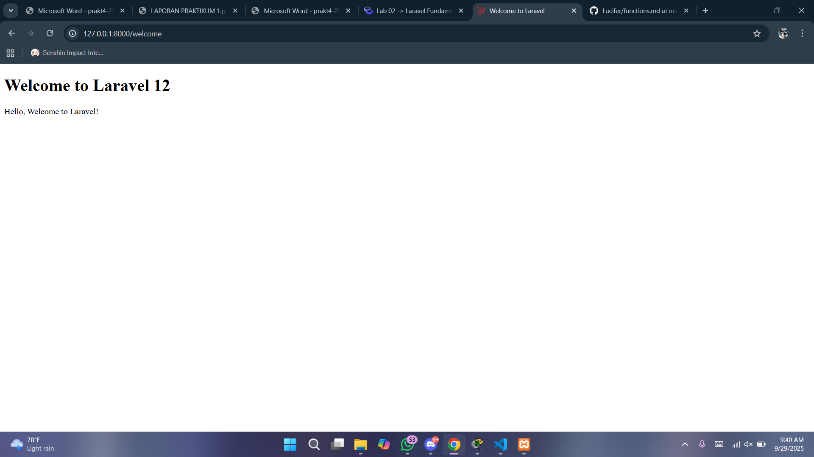

# Laporan Modul 2: Laravel Fundamentasl
**Mata Kuliah:** Workshop Web Lanjut   
**Nama:** Muhammad Fathurrahman  
**NIM:** 2024573010004
**Kelas:** TI-2C

---

## Abstrak 
Laporan ini membahas dasar-dasar framework Laravel seperti konsep MVC, routing, middleware, request dan response, controller, serta penggunaan Blade templating engine. Dari pembuatan route, controller, view sederhana, hingga membuat aplikasi kalkulator sederhana. Tujuan laporan ini yaitu untuk mempelajari cara menggunakan controller dalam php dan blade template engine

---

## 1. Dasar Teori
- **Apa itu MVC (Model, View, Controller).**
MVC adalah pola arsitektur yang memisahkan aplikasi menjadi tiga komponen utama yaitu:  
  1. Model (data dan logika bisnis)  
  2. View (antarmuka pengguna)
  3. Controller (menghubungkan keduanya dan menangani input pengguna).  

- **Konsep Routing di Laravel.**
  Routing di Laravel mekanisme suatu aplikasi untuk merespon request yang masuk ke URL tertentu. Singkatnya adalah proses pengiriman data maupun informasi ke pengguna melalui sebuah permintaan yang dilakukan kepada alamat yang sudah terdaftar, yang lalu alamat tersebut akan memproses permintaan kita tadi. Routing digunakan untuk menghubungkan URL dengan logika yang ada di aplikasi, bisa berupa closure, controller, atau bahkan langsung ke view. Route di Laravel didefinisikan di file routes/web.php untuk permintaan web dan di routes/api.php untuk route API.

  Berikut contoh route sederhana yang mengembalikan string saat diakses:

  ```bash
  use Illuminate\Support\Facades\Route;

  Route::get('/', function () {
      return 'Hello, Laravel!';
  });
  ```

- Fungsi Middleware.
Middleware adalah lapisan perangkat lunak yang berada di antara sistem operasi dan aplikasi yang berjalan di atasnya. Ia bertindak sebagai perantara yang cerdas, memfasilitasi komunikasi dan manajemen data antar aplikasi yang berbeda. 

Middleware dikategorikan berdasarkan fungsinya. Berikut beberapa jenis apa itu middleware yang paling umum:

    - Middleware Integrasi Aplikasi (Application Integration Middleware - AIM): Memfasilitasi pertukaran data antar aplikasi yang berbeda.
    - Middleware Pesan (Messaging Middleware): Memungkinkan aplikasi untuk berkomunikasi secara asinkron melalui pesan.
    - Middleware Keamanan (Security Middleware): Memastikan keamanan data dan akses ke sistem.
    - Middleware API (API Middleware): Membantu dalam pengelolaan, penerapan, dan keamanan API.
    - Middleware Jaringan (Network Middleware): Memfasilitasi komunikasi dan manajemen data antar perangkat di jaringan.

- Bagaimana cara Laravel menangani Request dan Response.
  Laravel menangani Request dan Response melalui siklus HTTP yang dimulai ketika sebuah request masuk ke aplikasi melalui public/index.php, lalu diteruskan ke HTTP Kernel yang memuat serangkaian middleware untuk memproses request (seperti autentikasi, validasi CSRF, logging). Setelah itu, request diarahkan ke route yang sesuai, yang kemudian memanggil controller atau closure untuk menjalankan logika aplikasi. Hasil dari proses tersebut dikembalikan dalam bentuk Response (bisa berupa view, JSON, redirect, atau data lain), lalu melalui lapisan middleware lagi sebelum akhirnya dikirim ke browser atau client.

- Peran Controller dan View.
  Controller: Mengatur alur antara model dan view. Controller menerima input dari pengguna (melalui route), memprosesnya (seringkali melibatkan model), dan mengembalikan view atau respons yang sesuai.
  View: Menangani lapisan presentasi — yaitu HTML yang ditampilkan kepada pengguna. Laravel menggunakan Blade sebagai template engine untuk view.
- Fungsi Blade Templating Engine.
  Blade templating adalah sistem template bawaan dari Laravel yang memungkinkan Anda untuk membuat tampilan web dengan cara yang lebih rapi dan terstruktur.

  Dengan Blade, Anda bisa membuat bagian-bagian dari halaman web, seperti header atau footer, yang bisa digunakan kembali di banyak halaman tanpa perlu menulis ulang kode. Tentunya, hal ini membuat proses pengembangan web lebih cepat dan mudah.

---

## 2. Langkah-Langkah Praktikum
Tuliskan langkah-langkah yang sudah dilakukan, sertakan potongan kode dan screenshot hasil.

2.1 Praktikum 1 – Route, Controller, dan Blade View

- Tambahkan route pada routes/web.php.
- Buat controller WelcomeController.
- Buat view mywelcome.blade.php.
- Jalankan aplikasi dan tunjukkan hasil di browser.

Screenshot Hasil:



2.2 Praktikum 2 – Membuat Aplikasi Sederhana "Calculator"

- Tambahkan route untuk kalkulator.
- Buat controller CalculatorController.
- Tambahkan view calculator.blade.php.
- Jalankan aplikasi dan coba dengan beberapa input berbeda.

Screenshot Hasil:


---

## 3. Hasil dan Pembahasan
Jelaskan apa hasil dari praktikum yang dilakukan.
- Apakah aplikasi berjalan sesuai harapan?
  Iya, semua berjalan dengan lancar ketika dibuka /calculator jika diinput angka pertama, angka kedua dan operator nya dipilih melalui dropdown maka hasil dari operasi tersebut akan ditampilkan pada layar.
- Apa yang terjadi jika ada input yang salah (misalnya pembagian dengan 0)?
  Jika ada input yang salah seperti melakukan pembagian dengan angka 0, maka program akan menampilkan pesan Error : Division by 0 sesuai dengan code yang sudah dibuat.
- Bagaimana validasi input bekerja di Laravel?
  Validasi input di Laravel itu cara untuk mengecek data yang dikirim user sebelum diproses. Misalnya, kalau ada form nama, email, dan password, Laravel akan memastikan nama tidak kosong, email benar formatnya, dan password cukup panjang sesuai aturan yang kita buat. Kalau ada yang salah, Laravel otomatis mengembalikan pesan error dan mengarahkan user kembali ke form dengan data lama masih terisi. Tapi kalau semua aturan sudah benar, data tersebut bisa langsung dipakai di controller atau disimpan ke database.
- Apa peran masing-masing komponen (Route, Controller, View) dalam program yang dibuat?
  Dalam program Laravel, Route berperan sebagai penghubung yang menentukan URL mana yang akan diarahkan ke bagian tertentu dari aplikasi, Controller bertugas menampung logika atau proses utama seperti mengolah data dan validasi, sedangkan View berfungsi untuk menampilkan hasilnya kepada pengguna dalam bentuk tampilan (seperti halaman HTML). Jadi alurnya: user mengakses URL → diarahkan oleh Route → diproses oleh Controller → hasilnya ditampilkan melalui View.

---

## 4. Kesimpulan

Dari praktikum ini dapat disimpulkan bahwa Laravel sebagai framework PHP memudahkan pengembangan aplikasi web melalui konsep MVC, sehingga logika program, tampilan, dan data dapat dipisahkan dengan jelas. Dengan memahami route, controller, dan view, kita bisa membangun alur aplikasi yang rapi dan terstruktur, sementara penggunaan Blade templating membuat tampilan lebih mudah dikelola dan dapat digunakan kembali. Praktikum juga menunjukkan pentingnya validasi input untuk menjaga agar data yang masuk sesuai aturan, serta bagaimana Laravel menangani request dan response secara otomatis. Melalui implementasi aplikasi kalkulator sederhana, konsep dasar Laravel terbukti dapat diaplikasikan dengan baik dan menghasilkan program yang berjalan sesuai harapan.

---

## 5. Referensi
Cantumkan sumber yang Anda baca (buku, artikel, dokumentasi) — minimal 2 sumber. Gunakan format sederhana (judul — URL).

Routing - https://www.codepolitan.com/blog/belajar-routing-laravel/
Middleware - https://www.codepolitan.com/blog/apa-itu-middleware-pengertian-contoh-dan-fungsinya/
Blade Template Engine - https://www.rumahweb.com/journal/belajar-laravel-bagian-4/
Validasi - https://buildwithangga.com/tips/belajar-validasi-laravel-dan-50-contoh-validasi-pada-projek-nyata

---
