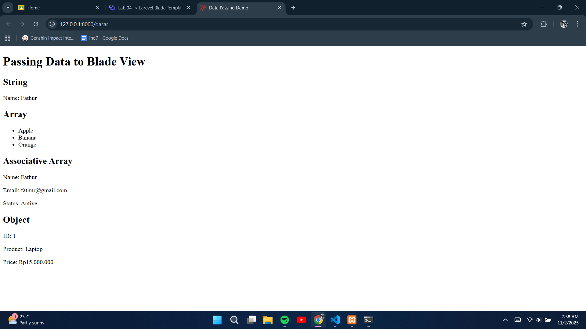
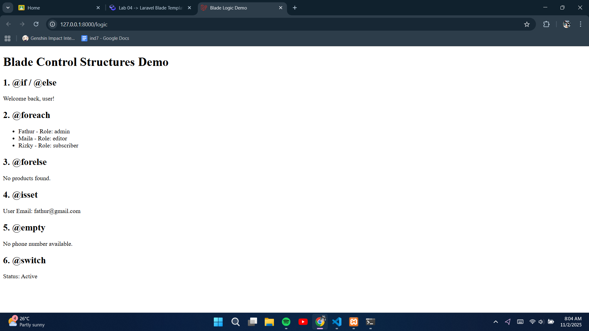
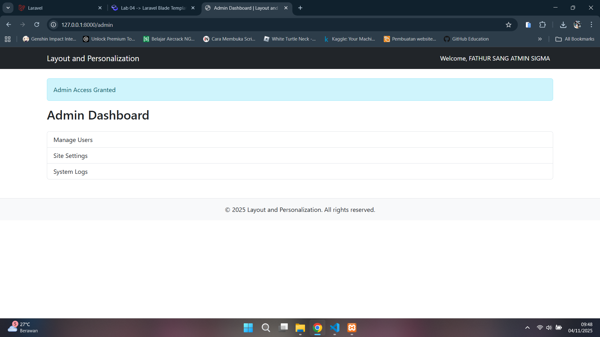
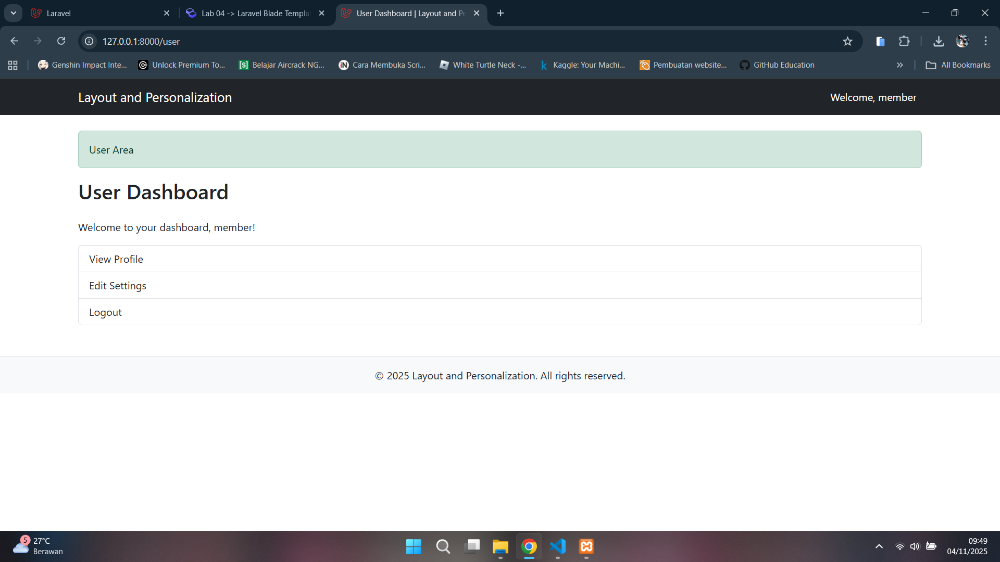
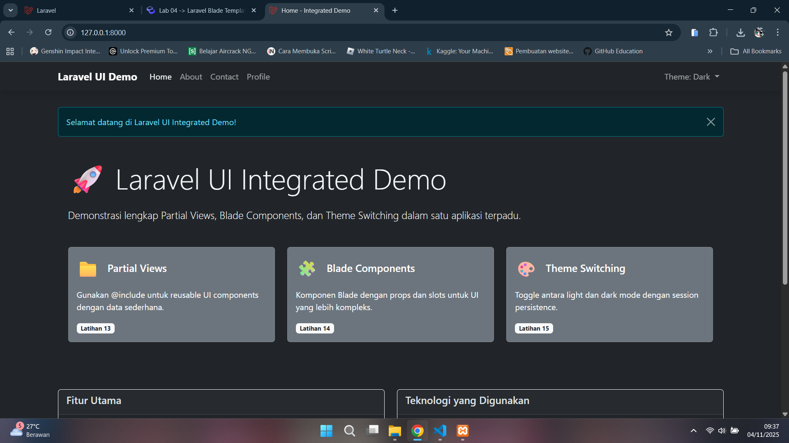
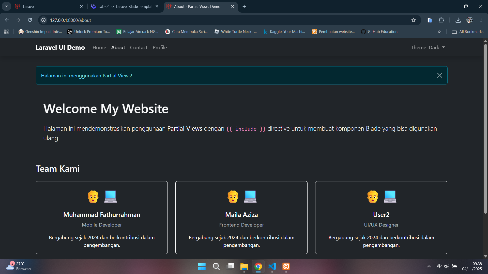
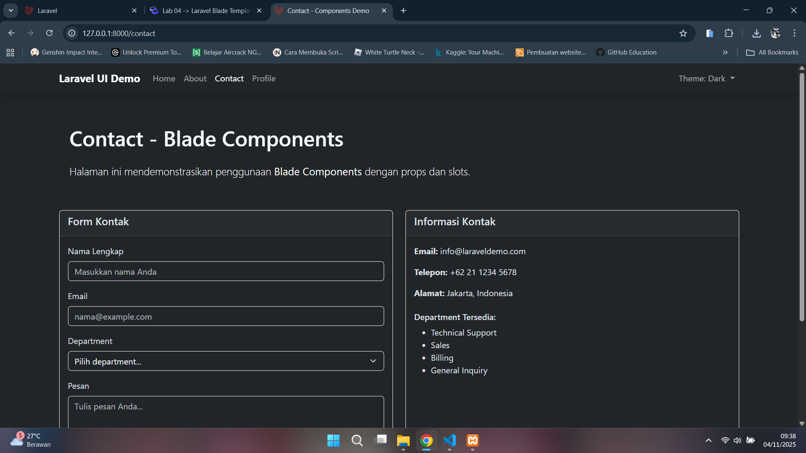
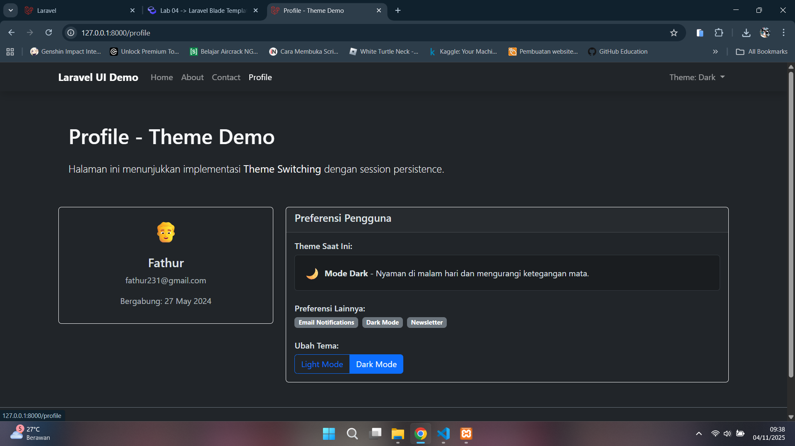
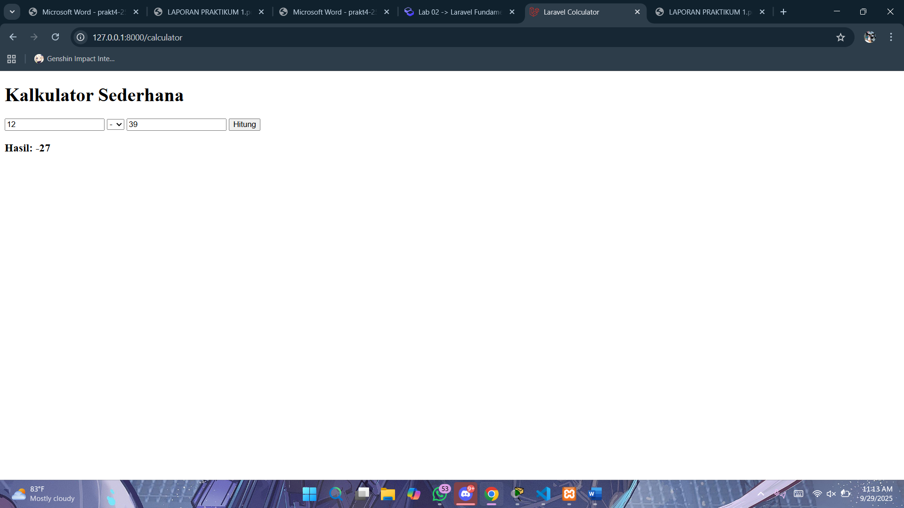
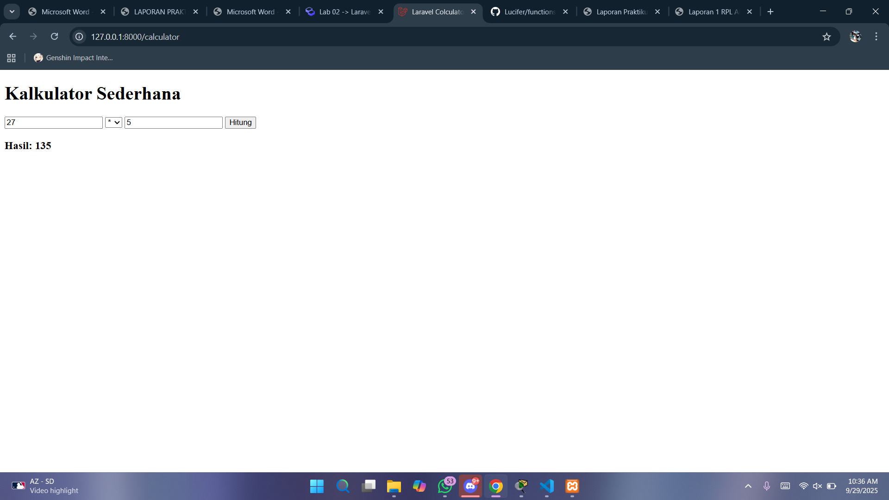

# Laporan Modul 4: Laravel Blade Template Engine
**Mata Kuliah:** Workshop Web Lanjut   
**Nama:** Muhammad Fathurrahman  
**NIM:** 2024573010004
**Kelas:** TI-2C

---

## Abstrak 
Laporan ini membahas tentang Blade Template Engine pada Laravel yang dimana Blade adalah mesin templating atau bisa juga dibilang sebagai blueprint yang memungkinkan Anda menulis code yang mudah dibaca menggunakan PHP dengan shortcut yang membantu.

---

## 1. Dasar Teori

Blade Template Engine adalah fitur bawaan dari Laravel yang berfungsi sebagai sistem templating untuk mempermudah pembuatan tampilan (view) di aplikasi web. Dengan Blade, developer bisa menulis HTML yang dicampur dengan sintaks khusus seperti @if, @foreach, dan @yield agar kode lebih bersih dan terstruktur. Selain itu, Blade juga mendukung pewarisan layout (layout inheritance) dan komponen yang bisa digunakan ulang, jadi kita gak perlu nulis kode yang sama berulang kali di banyak file. Intinya, Blade membuat proses pengembangan tampilan di Laravel jadi lebih cepat,, dan gampang dibaca.

---

## 2. Langkah-Langkah Praktikum
Tuliskan langkah-langkah yang sudah dilakukan, sertakan potongan kode dan screenshot hasil.

2.1 Praktikum 1 – Meneruskan Data dari Controller ke Blade View

- Buat proyek Laravel baru bernama `modul-4-blade-view`
- Buat sebuah Controller bernama DasarBladeController.
- Tambahkan route pada routes/web.php.
- Buat Metode untuk menghandle data pada Controller.
- Buat Blade View `dasar.blade.php`.
- Jalankan aplikasi dan tunjukkan hasil di browser.

Screenshot Hasil:



2.2 Praktikum 2 – Menggunakan Struktur Kontrol Blade

- Buat sebuah Controller baru bernama LogicController.
- Tambahkan route pada routes/web.php.
- Tambahkan Logika di Controller
- Buat Metode untuk menghandle data pada Controller.
- Buat Blade View `resources/views/logic.blade.php`.
- Jalankan aplikasi dan tunjukkan hasil di browser.

Screenshot Hasil:




2.3 Praktikum 3 – Layout dan Personalisasi di Laravel dengan Bootstrap

- Buat sebuah Controller baru bernama PageController.
- Tambahkan route pada routes/web.php.
- Buat Layout Dasar dengan Bootstrap
- Buat view untuk Admin
- Buat view untuk User
- Jalankan aplikasi dan tunjukkan hasil di browser.

Screenshot Hasil:
Admin: http://127.0.0.1:8000/admin

User: http://127.0.0.1:8000/user



2.4 Praktikum 4 – Partial Views, Blade Components, dan Theme Switching

- Buat proyek Laravel baru bernama `modul-4-laravel-ui`
- Buat sebuah Controller bernama UIController.
- Tambahkan route pada routes/web.php.
- Update Controller di `UIController`.
- Buat direktori `layouts` di `resources/views` jika belum ada.
- Kemudian buat `resources/views/layouts/app.blade.php`
- Buat direktori `partials` di `resources/views`  dan buat file berikut:
`resources/views/partials/navigation.blade.php`.
- Selanjutnya buat `resources/views/partials/alert.blade.php`.
- Buat Blade components:
  ```
  php artisan make:component Footer
  php artisan make:component FeatureCard
  php artisan make:component TeamMember
  php artisan make:component ContactForm
- Buat view-view utama
- Jalankan aplikasi dan tunjukkan hasil di browser.
Screenshot Hasil:
Home: http://127.0.0.1:8000

About: http://127.0.0.1:8000/about

Contact: http://127.0.0.1:8000/contact

Profile: http://127.0.0.1:8000/profile



<!-- 


 -->

---

## 3. Hasil dan Pembahasan
Jelaskan apa hasil dari praktikum yang dilakukan.
- Apakah aplikasi berjalan sesuai harapan?
  Iya, semua fitur yang dibuat di tiap praktikum jalan dengan baik. Mulai dari pengiriman data dari controller ke view, penggunaan struktur kontrol di Blade, sampai layout dan komponen semuanya bisa tampil sesuai rencana di browser tanpa error.
- Gimana hasil waktu coba kirim data dari controller ke view?
  Data bisa tampil di halaman Blade sesuai dengan variabel yang dikirim dari controller. Jadi contohnya pas dikirim nama atau pesan, hasilnya langsung mcuncul di tampilan tanpa harus mengubah HTML manual.

1. Hasil Praktikum 1 – Meneruskan Data dari Controller ke Blade View
Pada percobaan pertama, data berhasil dikirim dari controller ke tampilan menggunakan variabel yang di-passing melalui method with() atau array. Data yang dikirim kemudian ditampilkan di halaman Blade dengan memanfaatkan sintaks {{ $variable }}.

2. Hasil Praktikum 2 – Menggunakan Struktur Kontrol Blade
Dalam percobaan ini, struktur kontrol seperti @if, @elseif, @else, dan @foreach diuji dan bekerja dengan benar. Blade secara otomatis menerjemahkan sintaks tersebut menjadi kode PHP murni tanpa perlu menulis tag PHP manual.

3. Hasil Praktikum 3 – Layout dan Personalisasi di Laravel dengan Bootstrap
Pada percobaan ketiga, layout utama dibuat menggunakan Bootstrap untuk memberikan tampilan yang lebih menarik dan responsif. Blade memanfaatkan konsep template inheritance melalui sintaks @extends dan @section, yang memungkinkan setiap halaman menggunakan layout dasar yang sama.

4. Hasil Praktikum 4 – Partial Views, Blade Components, dan Theme Switching
Percobaan terakhir berfokus pada penggunaan partial views dan Blade components. Partial views seperti navigasi dan alert dipisahkan ke dalam file terpisah dan di-include menggunakan @include. Sementara itu, komponen seperti Footer, FeatureCard, TeamMember, dan ContactForm dibuat agar bisa digunakan ulang di berbagai halaman.

---

## 4. Kesimpulan

Dari praktikum ini bisa disimpulkan kalau Blade Template Engine adalah fitur penting di Laravel yang bikin pengelolaan tampilan jadi lebih efisien dan fleksibel. Dengan Blade, kita bisa pisahin logika dan tampilan, bikin layout reusable, dan nerapin struktur kontrol langsung di view tanpa bikin kode berantakan. Selain itu, penggunaan komponen dan partial view juga sangat membantu dalam membangun antarmuka web yang konsisten dan mudah dirawat.

---

## 5. Referensi
Cantumkan sumber yang Anda baca (buku, artikel, dokumentasi) — minimal 2 sumber. Gunakan format sederhana (judul — URL).

Laravel Blade Templating Engine — https://hackmd.io/@mohdrzu/r1AIUzWpll
Petani Kode — Belajar Blade Template di Laravel — https://www.petanikode.com/laravel-blade-template/
Sekolah Koding — Pengenalan Blade Template Laravel — https://www.sekolahkoding.com/kelas/laravel/blade-template

---
