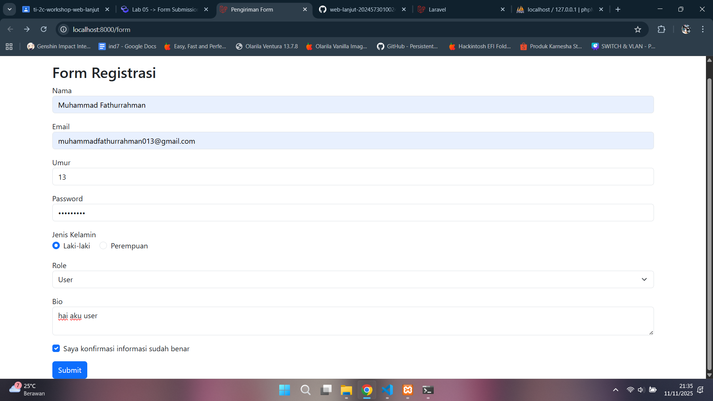
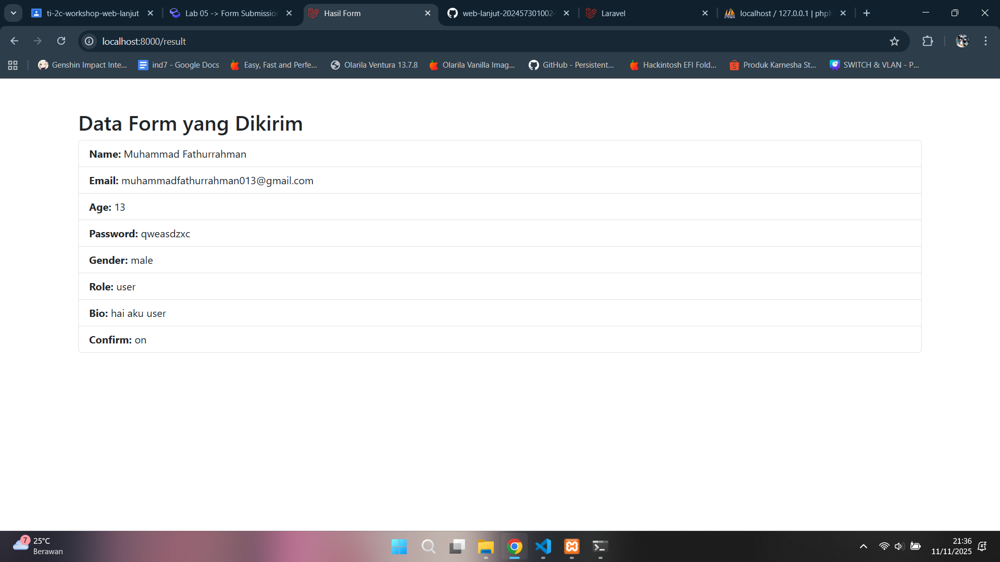
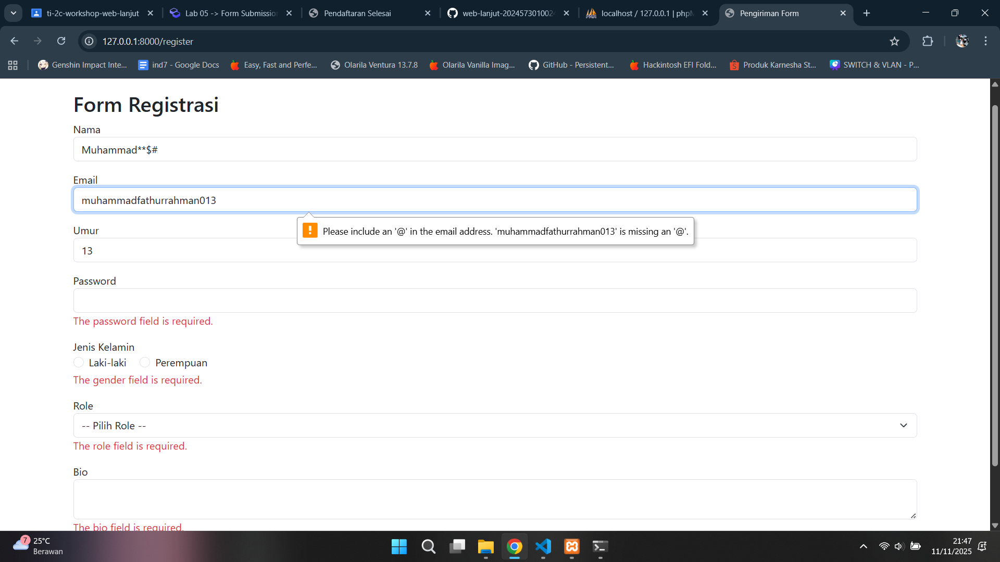
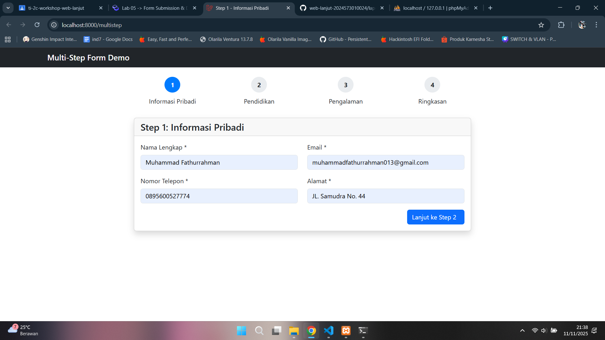
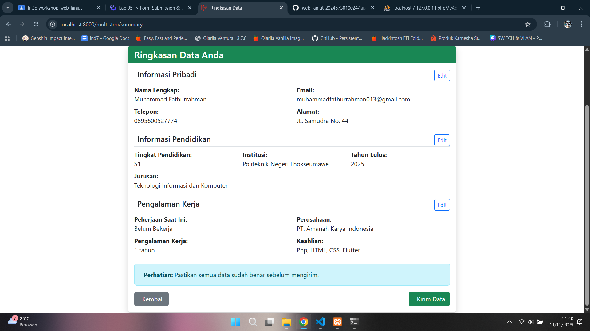

# Laporan Modul 5: Form Submission & Data Validation
**Mata Kuliah:** Workshop Web Lanjut   
**Nama:** Muhammad Fathurrahman  
**NIM:** 2024573010004
**Kelas:** TI-2C

---

## Abstrak 
Laporan ini membahas implementasi proses Form Submission dan Data Validation pada framework Laravel menggunakan Blade Template Engine. Tujuan dari praktikum ini adalah untuk memahami bagaimana data dikirim melalui form, divalidasi, dan ditampilkan kembali dengan cara yang efisien dan aman. Selain itu, laporan ini juga menunjukkan penerapan konsep multi-step form, validasi kustom, serta penggunaan session untuk menyimpan data antar halaman.

---

## 1. Dasar Teori

Form submission adalah proses pengiriman data dari pengguna melalui formulir HTML ke server untuk diproses. Dalam Laravel, proses ini difasilitasi melalui sistem routing, controller, dan request handling yang saling terintegrasi. Setiap form dapat memanfaatkan metode POST untuk mengirim data dan Laravel akan secara otomatis menangani token keamanan melalui CSRF protection.

Sementara itu, data validation bertujuan untuk memastikan bahwa input yang dikirim pengguna sudah sesuai dengan aturan yang ditentukan sebelum disimpan atau diproses lebih lanjut. Laravel menyediakan fitur Validator dan metode $request->validate() untuk mempermudah penerapan validasi baik standar maupun kustom.

---

## 2. Langkah-Langkah Praktikum
Tuliskan langkah-langkah yang sudah dilakukan, sertakan potongan kode dan screenshot hasil.

2.1 Praktikum 1 – Menangani Request dan Response View di Laravel 12

- Buat proyek Laravel baru bernama `form-app`
- Tambahkan route pada routes/web.php.
```bash
use App\Http\Controllers\FormController;

Route::get('/form', [FormController::class, 'showForm'])->name('form.show');
Route::post('/form', [FormController::class, 'handleForm'])->name('form.handle');
Route::get('/result', [FormController::class, 'showResult'])->name('form.result');
```
- Buat controller bernama `FormController`
- Buat Metode untuk menghandle data pada Controller.
- Buat Blade View Form `form.blade.php`.
- Buat Blade View Hasil `result.blade.php`.
- Jalankan aplikasi dan tunjukkan hasil di browser.

Screenshot Hasil:




2.2 Praktikum 2 – Validasi Kustom dan Pesan Error di Laravel 12

- Pada project praktikum 1, tambah route baru sebgai berikut
```bash
use App\Http\Controllers\RegisterController;

Route::get('/register', [RegisterController::class, 'showForm'])->name('register.show');
Route::post('/register', [RegisterController::class, 'handleForm'])->name('register.handle');
```
- Tambahkan controller baru bernama `RegisterController`.
- Buat Blade View `register.blade.php`.
- Jalankan aplikasi dan tunjukkan hasil di browser.
Buka http://localhost:8000/register untuk test form regis.

Screenshot Hasil:




2.3 Praktikum 3 – Multi-Step Form Submission dengan Session Data

- Buat project baru bernama `multistep-form-app`
- Tambahkan route pada routes/web.php.
```bash
<?php

use App\Http\Controllers\MultiStepFormController;
use Illuminate\Support\Facades\Route;

Route::get('/multistep', [MultiStepFormController::class, 'showStep1'])->name('multistep.step1');
Route::post('/multistep/step1', [MultiStepFormController::class, 'storeStep1'])->name('multistep.storeStep1');
Route::get('/multistep/step2', [MultiStepFormController::class, 'showStep2'])->name('multistep.step2');
Route::post('/multistep/step2', [MultiStepFormController::class, 'storeStep2'])->name('multistep.storeStep2');
Route::get('/multistep/step3', [MultiStepFormController::class, 'showStep3'])->name('multistep.step3');
Route::post('/multistep/step3', [MultiStepFormController::class, 'storeStep3'])->name('multistep.storeStep3');
Route::get('/multistep/summary', [MultiStepFormController::class, 'showSummary'])->name('multistep.summary');
Route::post('/multistep/complete', [MultiStepFormController::class, 'complete'])->name('multistep.complete');
```
- Buat Layout Dasar dengan Blade `app.blade.php`
- Buat controller `MultiStepFormController`
- Buat view untuk tiap step:
Buat folder resources/views/multistep/
```
Step 1 - Informasi Pribadi: resources/views/multistep/step1.blade.php
Step 2 - Informasi Pendidikan: resources/views/multistep/step2.blade.php
Step 3 - Pengalaman Kerja: resources/views/multistep/step3.blade.php
Summary - Ringkasan: resources/views/multistep/summary.blade.php
Complete - Selesai: resources/views/multistep/complete.blade.php
```
- Jalankan aplikasi dan tunjukkan hasil di browser.
 http://localhost:8000/multistep 

Screenshot Hasil:






---

## 4. Kesimpulan

Dari praktikum ini dapat disimpulkan bahwa proses form submission dan data validation di Laravel sangat efisien berkat integrasi antara controller, route, dan Blade Template Engine. Penggunaan Blade membuat struktur tampilan menjadi lebih rapi dan mudah dikelola. Fitur validasi Laravel juga memberikan kemudahan dalam memastikan keamanan serta konsistensi data yang diterima. Selain itu, penerapan multi-step form menunjukkan bagaimana session dapat digunakan untuk menyimpan data sementara antar tahap, sehingga alur input pengguna tetap terjaga tanpa kehilangan data. Secara keseluruhan, Laravel menyediakan pendekatan yang terstruktur, aman, dan mudah dipahami dalam pembuatan sistem form interaktif berbasis web.

---

## 5. Referensi
Cantumkan sumber yang Anda baca (buku, artikel, dokumentasi) — minimal 2 sumber. Gunakan format sederhana (judul — URL).

Laravel Blade Templating Engine — https://hackmd.io/@mohdrzu/r1AIUzWpll
Petani Kode — Belajar Form Request dan Validasi di Laravel — https://www.petanikode.com/laravel-form-validation/

---
