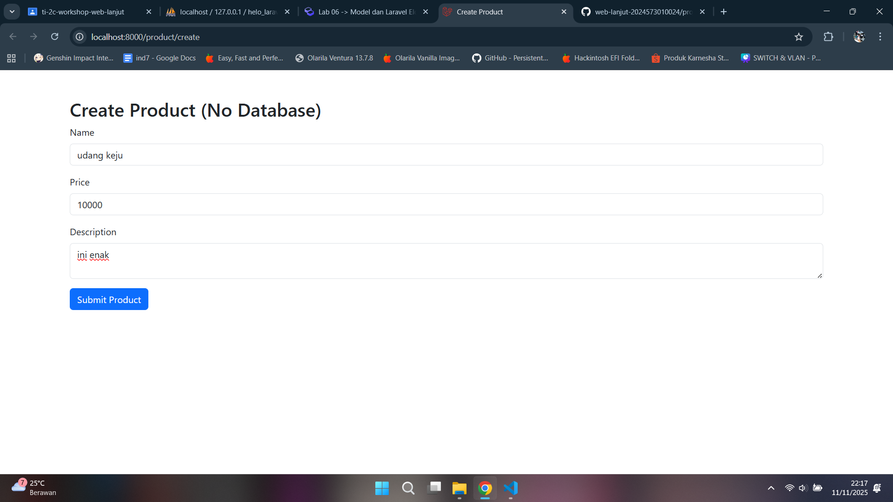
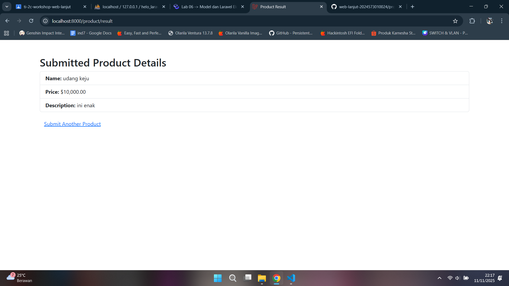
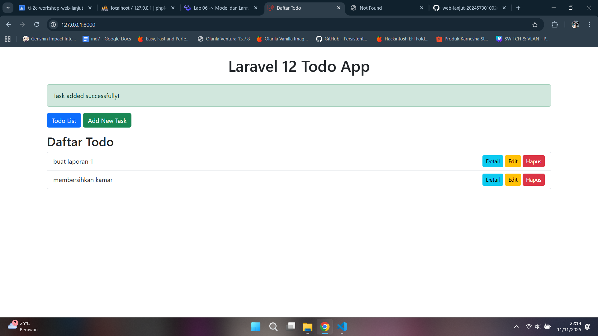

# Laporan Modul 6: Model dan Laravel Eloquent
**Mata Kuliah:** Workshop Web Lanjut   
**Nama:** Muhammad Fathurrahman
**NIM:** 2024573010004
**Kelas:** TI-2C

---

## Abstrak 
Dalam framework Laravel, Model berperan sebagai komponen utama dalam arsitektur MVC (Model-View-Controller). Model digunakan untuk merepresentasikan data dan berinteraksi langsung dengan database. Melalui fitur Eloquent ORM, Laravel menyediakan cara yang efisien dan elegan untuk mengelola data tanpa harus menulis query SQL secara manual. Dengan memanfaatkan model dan Eloquent, proses pengembangan aplikasi web menjadi lebih terstruktur, cepat, serta mudah untuk dikelola dan dikembangkan.

---

## 1. Dasar Teori
Model merupakan komponen penting dalam pengembangan aplikasi berbasis Laravel karena berfungsi sebagai penghubung antara logika bisnis dan data yang tersimpan di database. Model merepresentasikan tabel dalam database sebagai sebuah objek sehingga pengembang dapat melakukan operasi seperti create, read, update, dan delete (CRUD) menggunakan sintaks yang sederhana dan intuitif.

Laravel menyediakan Eloquent ORM (Object Relational Mapping) sebagai implementasi dari konsep model. Eloquent memungkinkan setiap tabel di database memiliki representasi dalam bentuk kelas model, dan setiap baris datanya dapat diperlakukan sebagai objek. Dengan demikian, interaksi terhadap database menjadi lebih mudah dipahami dan dipelihara. Selain itu, penggunaan Data Transfer Object (DTO) dan service layer membantu memisahkan logika bisnis dari lapisan data, meningkatkan modularitas serta menjaga kebersihan kode dalam pengembangan aplikasi.

---

## 2. Langkah-Langkah Praktikum

2.1 Praktikum 1 – Menggunakan Model untuk Binding Form dan Display

1. Buat dan buka project laravel
```
laravel new model-app
cd model-app
code .
```
2. Membuat model data sederhana (POCO)
`mkdir app/ViewModels`
3. Buat controller 
`php artisan make:controller ProductController`
4. Definisikan route `routes/web.php`
5. Buat tampilan (views) dengan bootstrap `resources/views/product`
kemudian buat dua file:
- `create.blade.php`
- `result.blade.php`
6. Jalankan aplikasi dan tunjukkan hasil di browser.

Hasil:



2.2 Praktikum 2 – Menggunakan DTO (Data Transfer Object)

1. Buat dan buka project laravel
```
laravel new dto-app
cd dto-app
code .
```
2. Buat kelas DTO
`mkdir app/DTO`
3. Buat service layer
`mkdir app/Services`
4. Buat controller
`php artisan make:controller ProductController`
5. Definisikan route `routes/web.php`:
```
<?php

use App\Http\Controllers\ProductController;
use Illuminate\Support\Facades\Route;

Route::get('/product/create', [ProductController::class, 'create'])->name('product.create');
Route::post('/product/result', [ProductController::class, 'result'])->name('product.result');
```
6. Buat tampilan (views) dengan bootstrap
Buat direktori product di dalam `resources/views`:
`mkdir resources/views/product`
Buat dua file:
- `create.blade.php`
- `result.blade.php`
7. Jalankan aplikasi dan tunjukkan hasil di browser.

Hasil:


2.3 Praktikum 3 – Membangun Aplikasi Web Todo Sederhana dengan Laravel 12, Eloquent ORM, dan MySQL

1. Setup aplikasi dan konfigurasi MySQL
```
laravel new todo-app-mysql
cd todo-app-mysql
code .
```
- Pastikan MySQL berjalan dan buat database:
`CREATE DATABASE tododb;`
- Install dependency MySQL:
`composer require doctrine/dbal`
- Konfigurasi MySQL pada file `.env`
- Bersihkan config cache: 
`php artisan config:clear`
2. Buat migration untuk table todos:
`php artisan make:migration create_todos_table`
- Jalankan migrasi:
`php artisan migrate`
3. Buat seeder untuk data dummy
`php artisan make:seeder TodoSeeder`
- Jalankan seeder untuk mengisi database
`php artisan db:seed --class=TodoSeeder`
4. Buat model todo
- Jalankan:
`php artisan make:model Todo`
5. Buat TodoController untuk operasi CRUD
`php artisan make:controller TodoController`
6. Definisikan rute untuk aplikasi Todo di file `routes/web.php`
```
<?php

use Illuminate\Support\Facades\Route;
use App\Http\Controllers\TodoController;

Route::get('/', [TodoController::class, 'index'])->name('todos.index');
Route::get('/todos/create', [TodoController::class, 'create'])->name('todos.create');
Route::post('/todos', [TodoController::class, 'store'])->name('todos.store');
Route::get('/todos/{todo}', [TodoController::class, 'show'])->name('todos.show');
Route::get('/todos/{todo}/edit', [TodoController::class, 'edit'])->name('todos.edit');
Route::patch('/todos/{todo}', [TodoController::class, 'update'])->name('todos.update');
Route::delete('/todos/{todo}', [TodoController::class, 'destroy'])->name('todos.destroy');
```
- Beri komentar untuk menghindari konflik:
```
// Route::get('/', function () {
//     return view('welcome');
// });
```
7. Buat tampilan blade dengan bootstrap
Buat folder layouts di `resources/views` dan buat file baru `resources/views/layouts/app.blade.php`.
- Halaman todo
Sekarang kita akan membuat tampilan untuk aplikasi Todo. Buat folder baru todos di `resources/views` dan buat file-file berikut:
a. `index.blade.php`
b. `create.blade.php`
c. `edit.blade.php`
d. `show.blade.php`
8. Jalankan aplikasi dan tunjukkan hasil di browser.

Hasil:



## 4. Kesimpulan
Pemahaman tentang model dan Eloquent dalam Laravel sangat penting untuk membangun aplikasi web yang efisien dan terstruktur. Dengan Eloquent, pengembang dapat mengelola data dengan sintaks yang sederhana tanpa perlu menulis query SQL yang kompleks. Selain itu, penerapan DTO dan repository pattern membantu menjaga arsitektur aplikasi tetap modular, terpisah antara logika bisnis dan akses data. Secara keseluruhan, penggunaan model dan Eloquent mampu mempercepat proses pengembangan, meningkatkan keterbacaan kode, serta memudahkan proses pemeliharaan aplikasi dalam jangka panjang.

---

## 5. Referensi

Model dan Laravel Eloquent — https://hackmd.io/@mohdrzu/ryIIM1a0ll
Apa itu Model pada Framework Laravel? — https://buildwithangga.com/tips/apa-itu-model-pada-framework-laravel
Laravel Eloquent (Belajar Laravel #10) — https://informatika.ciputra.ac.id/2019/11/laravel-eloquent/

---