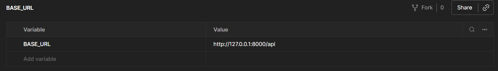
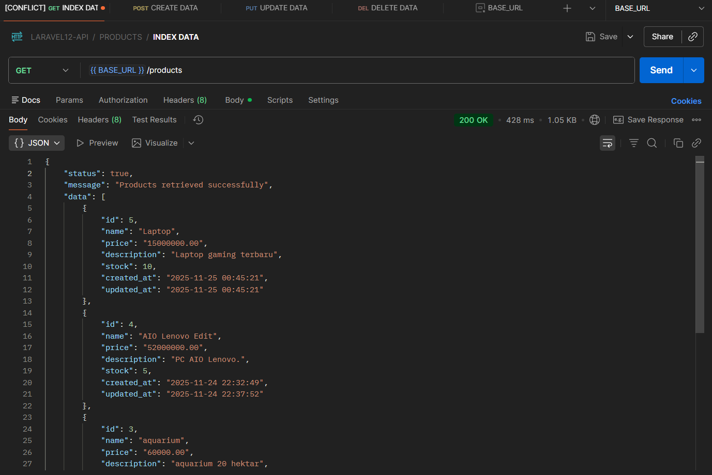
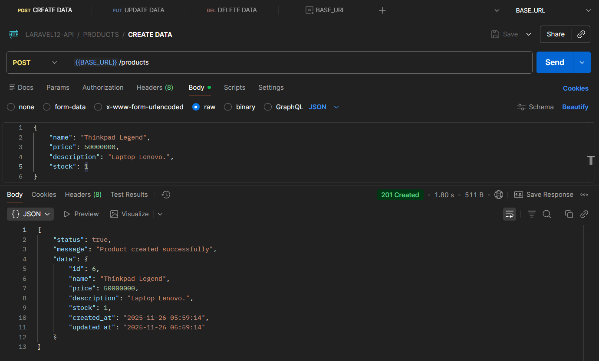

# Laporan Modul 8: Authentication & Authorization

**Mata Kuliah:** Workshop Web Lanjut  
**Nama:** Muhammad Fathurrahman  
**NIM:** 2024573010004
**Kelas:** TI-2C

---

## Abstrak

Laporan ini membahas penerapan autentikasi dan otorisasi dalam aplikasi Laravel, dimulai dari penggunaan Laravel Breeze untuk membangun fitur pendaftaran, login, pengelolaan profil, serta pembatasan hak akses menggunakan middleware.Kita dapat mempelajari cara membangun sistem login yang aman, membuat rute yang aman dari ancaman hacker, menambahkan role seperti admin, manager, dan user, serta mengelola akses setiap role secara terpisah. Secara keseluruhan, modul ini memberikan dasar lengkap untuk memahami dan menerapkan security access pada aplikasi Laravel.

---

## 1. Dasar Teori

Autentikasi adalah proses verifikasi identikasi user apakah seseorang benar-benar orang yang mereka claim. Contoh saat kita ingin login ke dalam suatu web, maka sistem akan meminta username dan password. Jika cocok dengan data yang tersimpan maka boleh masuk.

Otorisasi adalah proses yang menentukan apakah seseorang boleh melakukan aksi ini atau tidak oleh pengguna yang telah terautentikasi di dalam aplikasi. Contohnya seperti user tidak bisa mengakses halaman admin.

---

## 2. Langkah-Langkah Praktikum

Tuliskan langkah-langkah yang sudah dilakukan, sertakan potongan kode dan screenshot hasil.

2.1 Praktikum 1 – 

-   Buat Proyek Laravel baru bernama `laravel-api`
-   Atur database
    Di file .env harus tampak seperti ini:
    ```
    DB_CONNECTION=mysql
    DB_HOST=127.0.0.1
    DB_PORT=3306
    DB_DATABASE=authlab_db
    DB_USERNAME=<username database anda>
    DB_PASSWORD=<password database anda jika ada>
    ```
    dan jalankan `php artisan migrate` untuk membuat database dan table secara otomatis
-   Instalasi Laravel Breeze
    Jalankan perintah berikut untuk download breeze
    ```
    composer require laravel/breeze --dev
    ```
    Kemudian jalankan untuk menginstall breeze ke dalam project
    ```
    php artisan breeze:install
    ```
    Selama proses instalasi, Anda akan diminta beberapa opsi:
    - Pilih frontend framework: Pilih api (wajib)
    
    Install dependency frontend:
    ```bash
    npm install
    npm run dev
    ```
-   Model dan Migrasi
    Silakan jalankan perintah berikut untuk membuat model dan migrasinya:
    ```
    php artisan make:model Product -m
    ```
    Perintah diatas akan menghasilkan 2 file baru, yaitu model dan migrasi.
    - Migrasi
        Silahkan buka file migration yang baru dibuat dan pada function up ubah menjadi seperti dibawah ini:
        ```bash
        public function up()
        {
            Schema::create('products', function (Blueprint $table) {
                $table->id();
                $table->string('name');
                $table->decimal('price', 10, 2);
                $table->text('description')->nullable();
                $table->integer('stock')->default(0);
                $table->timestamps();
            });
        }
        ```
        Jalankan:
        ```
        php artisan migrate
        ```

    - Model
        Buka file Model dan isi class Product:
        ```bash
        use HasFactory;

        protected $fillable = ['name', 'price', 'description', 'stock'];
        ```
        $fillable adalah daftar kolom yang boleh diisi secara massal dengan metode create() atau update().

-   Product Request
    Silakan jalankan perintah berikut untuk membuat ProductRequest.
    ```
    php artisan make:request ProductRequest
    ```
    Perintah diatas akan menghasilkan sebuah filde dengan nama ProductRequest.php yang terletak didalam folder app/Http/Requests. Silakan buka file tersebut kemudian tambahkan kode ini dalam class ProductRequest:
    ```bash
    public function authorize(): bool
    {
        return true; 
    }

    public function rules(): array
    {
        return [
            'name' => 'required|string|max:255',
            'price' => 'required|numeric',
            'description' => 'nullable|string',
            'stock' => 'required|integer|min:0',
        ];
    }
    ```
    -   Authorize
    Didalam method ini, bertujuan untuk menentukan apakah pengguna diizinkan untuk melakukan request ini. Jika true, maka request dapat diproses. Jika false, request akan ditolak.
    -   Rules
    Pada Method ini berisi aturan validasi untuk setiap field, seperti aturan pada column name, wajib diisi type data string dan maksimal 255 karakter dst.

-   Product Resource
    Silakan jalankan perintah beriukut untuk membuat ProductResource.
    ```
    php artisan make:resource ProductResource
    ```
    Perintah diatas akan menghasilkan file yang terletak di App\Http\Resources\ProductResource.php. Silakan buka file tersebut, dalam class ProductResource tambahkan kode berikut ini:
    ```bash
    public function toArray(Request $request): array
    {
        return [
            'id' => $this->id,
            'name' => $this->name,
            'price' => $this->price,
            'description' => $this->description,
            'stock' => $this->stock,
            'created_at' => $this->created_at->format('Y-m-d H:i:s'),
            'updated_at' => $this->updated_at->format('Y-m-d H:i:s'),
        ];
    }
    ```
-   Product Collection
    Silakan jalankan perintah beriukut untuk membuat ProductCollection.
    ```
    php artisan make:resource ProductCollection
    ```
    Perintah diatas akan menghasilkan file yang terletak di App\Http\Resources\ProductCollection.php. Silakan buka file tersebut, dalam class ProductCollection tambahkan kode berikut ini:
    ```bash
    public function toArray(Request $request): array
    {
        return [
            'status' => true,
            'message' => 'Products retrieved successfully',
            'data' => $this->collection, 
            'meta' => [
                'current_page' => $this->currentPage(),
                'last_page' => $this->lastPage(),
                'per_page' => $this->perPage(),
                'total' => $this->total(),
            ],
        ];
    }
    ```

-   Product Controller
    Silakan jalankan perintah berikut ini untuk membuat Controller Product.
    ```
    php artisan make:controller API\ProductController
    ```
    Silahkan buka `app/Http/Controllers/API/ProductController.php`, dan tambahkan beberapa function menjadi seperti berikut ini:
    ```bash
    public function index()
    {
        $products = Product::latest()->paginate(10);
        return response()->json(new ProductCollection($products), Response::HTTP_OK);
    }

    public function store(ProductRequest $request)
    {
        $product = Product::create($request->validated());

        return response()->json([
            'status' => true,
            'message' => 'Product created successfully',
            'data' => new ProductResource($product),
        ], Response::HTTP_CREATED);
    }

    public function show(Product $product)
    {
        return response()->json([
            'status' => true,
            'message' => 'Product retrieved successfully',
            'data' => new ProductResource($product)
        ], Response::HTTP_OK);
    }

    public function update(ProductRequest $request, Product $product)
    {
        $product->update($request->validated());

        return response()->json([
            'status' => true,
            'message' => 'Product updated successfully',
            'data' => new ProductResource($product),
        ], Response::HTTP_OK);
    }

    public function destroy(Product $product)
    {
        $product->delete();

        return response()->json([
            'status' => true,
            'message' => 'Product deleted successfully',
        ], Response::HTTP_OK);
    }
    ```

-   Konfigurasi Route
    Silakan buka file api.php, kemudian tambahkan rute berikut ini:
    ```
    Route::apiResource('products', ProductController::class);
    ```

- Konfigurasi Postman
    Dibagian sidebar pada Postman terdapat Environment, kita harus menyetelnya terlebih dahulu. Pada kolom Varible isi dengan `BASE_URL` dan pada kolom Value kita isi dengan url yang kita dapatkan dari menjalankan project `laravel-api`.
    

-   Fungsi index()
    Fungsi ini bertujuan untuk mengambil produk dari database dan mengembalikannya dalam format JSON, adapun data yang diambil adalah data produk terbaru dengan pagination 10 item per halaman. Untuk melakukan uji coba hasilnya, teman-teman bisa melakukan ujicoba pada postman seperti pada gambar berikut ini:
    

-   Fungsi create()
    Fungsi ini bertujuan untuk insert data kedalam database melalui endpoint API yang sudah kita definisikan sebelumnya, Silakan add request didalam postman berikan nama CREATE DATA. Gunakan methode POST dengan endpoint berikut ini: `http://127.0.0.1:8000/api/products` yang bisa kita tulis dalam variabel yaitu `{{ BASE_URL }}/products`. <br>
    Didalam tab body, silakan pilih raw dengan type data json, kemudian masukkan contoh data object berikut ini:
    ```
    {
        "name": "AIO Lenovo",
        "price": 50000000,
        "description": "PC AIO Lenovo.",
        "stock": 1
    }
    ```
    Kemudian tekan send, maka hasilnya bisa dilihat pada bagian bawah datanya sudah berhasil diinsert ke dalam database.
    
---

## 3. Kesimpulan

lorem

---

## 4. Referensi

Cantumkan sumber yang Anda baca (buku, artikel, dokumentasi) — minimal 2 sumber. Gunakan format sederhana (judul — URL).

Laravel Blade Templating Engine — https://hackmd.io/@mohdrzu/r1AIUzWpll
---
